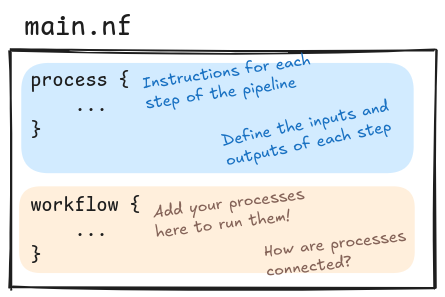

# 1.3 Writing your first pipeline

!!! info "Learning objectives"

    1. Understand the structure and purpose of `process` and `workflow` blocks in Nextflow scripts
    2. Understand how to define a simple `process` using `script` and `output` blocks
    3. Create a complete, single-step Nextflow pipeline
    4. Evaluate script readability using comments

Workflow languages, such as Nextflow, provide a structured way of managing multi-step analyses. Workflow languages can help you coordinate individual tasks, handle dependencies, enable parallel execution, and improve reproducibility. They also make your code easier to maintain and share with others.

Here, you're going learn more about the Nextflow language and take your first steps making **your first pipeline** with Nextflow.

## 1.3.1 Understanding the `process` and `workflow` scopes

Nextflow pipelines are written inside `.nf` files. They consist of a combination of two main components: **processes** and the **workflow** itself. Each process describes a single step of the pipeline, including its inputs and expected outputs, as well as the code to run it. The workflow then defines the logic that puts all of the processes together.



### `process`

A process definition starts with the keyword `process`, followed by a process name, and finally the process body delimited by curly braces. The process body must contain a `script` block which represents the command or, more generally, a script that is executed by it.

A process may contain any of the following definition blocks. The ones we will be focusing on this workshop are presented in bold: **`directives`**, **`input`**, **`output`**, `stub`, `when` clauses, and of course, **`script`**.

```groovy
process < name > {
  [ directives ]

  input:
    < process inputs >

  output:
    < process outputs >

  script:
  """
  <script to be executed>
  """
}
```

### `workflow`

A workflow is a composition of processes and dataflow logic.

The workflow definition starts with the keyword `workflow`, followed by an optional name, and finally the workflow body delimited by curly braces.

```groovy
workflow {
    < processes to be executed >
}
```

!!! info "Tip"

    The `process` and `workflow` definitions are analogous to functions in R or
    Python languages. You first have to define a function (the `process`) that
    contains the instructions of what to do. In order to do the action, the
    function needs to be called (in the `workflow`).

Let's review the structure of `hello-world.nf`, a toy example you will be developing and executing in Part 1.

```groovy title="hello-world.nf" linenums="1"
process SAYHELLO {

    output:
    path 'output.txt'

    script:
    """
    echo 'Hello World!' > output.txt
    """
}

workflow {
    SAYHELLO()
}
```

The first piece of code (lines 1-11) describes a **process** called `SAYHELLO` with two definition blocks:

- **output**: defines that the process will output a file called `output.txt`. It also contains the `path` qualifier. We will review this in the next section.
- **script**: the `echo 'Hello World!'` command redirects to a file called `output.txt`

The second block of code (12-14) lines describes the **workflow** itself, which consists of one call to the `SAYHELLO` process.

We will start building the `hello-world.nf` script, piece-by-piece, so you can get a feel
for the requirements for a writing a Nextflow workflow.

The order of steps taken to build the process in the following exercises are intentional. We will
be building processes by defining each process block starting with the `script` then the `output`.
In later sections, we will add `input` and process `directives` to this order.

This order **is not prescriptive**, however, the `script` logic often determines how the other process
blocks should look like and this order can be helpful for breaking down building processes in a
logical way. This approach will be continued in Part 2, when you build an RNA-seq workflow!

!!! question "Exercises"

    1. Create a new file `hello-world.nf`.

    2. In the new file, define an empty `process` and call it `SAYHELLO`.
    
    ??? "Solution"
        ```groovy title="hello-world.nf"
        process SAYHELLO {
        
        }
        ```

    <ol start="3">
        <li>Add the `script` definition that writes 'Hello World!' to a file called `output.txt`.</li>
    </ol>

    ??? "Solution"
        ```groovy title="hello-world.nf" hl_lines="3-6"
        process SAYHELLO {
        
            script:
            """
            echo 'Hello World!' > output.txt
            """
        }
        ```

## 1.3.2 Commenting your code

Before we complete our process, we will **comment** our code. Commenting your code is worthwhile so we, and others, can easily understand what the code is doing (you will thank yourself later).

In Nextflow, a single line comment can be added by prepending it with two forward slash (`//`):

```groovy
// This is my comment
```

Similarly, multi-line comments can be added using the following format:

```groovy
/*
 *  This is my multi-line comment
 */
```

As a developer you can to choose how and where to comment your code.

!!!question "Exercise"

    Add a comment to the pipeline to describe what the **process** block is doing.
    You can use the comments provided in the solutions, however we highly recommend 
    writing your own comment that is useful for your understanding.

    ??? "Solution"

        The solution may look something like this:

        ```groovy title="hello-world.nf" hl_lines="1-3"
        /*
         * Use echo to print 'Hello World!' to a text file
         */
        process SAYHELLO {
        
            script:
            """
            echo 'Hello World!' > output.txt
            """
        }
        ```

        Or this:

        ```groovy title="hello-world.nf" hl_lines="1-3"
        // Use echo to print 'Hello World!' to a text file
        process SAYHELLO {
        
            script:
            """
            echo 'Hello World!' > output.txt
            """
        }
        ```

        As a developer, you get to choose!

## 1.3.3 Capturing process outputs 

In the previous section, you have defined the `script` - what the `SAYHELLO` process should do.
We also need to tell Nextflow to expect this output file - otherwise, it will ignore it!

We declare outputs using the `output` definition block. Typically this will require
both an **output qualifier** and an **output name**:

```groovy
output:
<output qualifier> <output name>
```

Output _qualifiers_ are keywords used inside processes to tell Nextflow what type of output to expect
(e.g. a folder, file, or value).

Common output qualifiers include `path` and `val`:

- `path`: Emit a file produced by the process with the specified name
- `val`: Emit the variable with the specified name

### `path`

For example, the output `path "output.txt"` tells Nextflow that the process outputs a file called `output.txt`. Nextflow can then track that file and pass it correctly to any downstream processes that need it.

### `val`

If you attempt to use the output `val "output.txt"`, it will outputs the literal string `"output.txt"`. Any downstream process that expects a file won't be able to do anything with this and will fail. The `val` output is useful for keeping track of metadata across steps. We will explore this more in Part 2.

See the [Nextflow documentation](https://www.nextflow.io/docs/latest/process.html#outputs)
for a full list of output qualifiers.

!!! warning

    Qualifiers don't only indicate the type of file, but it's an important part of telling Nextflow processes how this information should be handled. If you set the wrong qualifier, the pipeline will likely throw errors.

The **output name** is a name given to the output variable. This can be whatever you want it to be, however, the output name and the file generated by the script must match, or else Nextflow won't find it and will throw an error.

!!! note

    It's important to remember that the output block doesn't create the output, it just tells Nextflow what to expect after the process runs.
    Whether or not that output actually exists depends on what your script does inside the `script` block.
    If your script doesn't create the file, Nextflow won't find it and will assume the process has failed.
    This is helpful because:

    - Nextflow checks that the declared output is actually there. If it's missing it knows something went wrong;
    - Nextflow uses outputs to connect processes together, it waits for the output before moving to the next step.
    
!!!question "Exercise"

    In your `SAYHELLO` process, add an `output` block that captures `'output.txt'`.
    Since it is a file being emitted by the process, the `path` qualifier must be
    used.

    ??? "Solution"
        ```groovy title="hello-world.nf" hl_lines="4-6"
        // Use echo to print 'Hello World!' to a text file
        process SAYHELLO {

            output:
            path 'output.txt'
        
            script:
            """
            echo 'Hello World!' > output.txt
            """
        }
        ```

This example is brittle because the output filename is hardcoded in two separate places
(the `script` and the `output` definition blocks). If you change one but not the other, the script will break because they need to match. We will review how to solve this in the Dynamic Naming lesson.

**You have now defined your first process!**

## 1.3.4 Calling the process in the `workflow` scope

We have now defined a functional process for `SAYHELLO`. To ensure that it runs,
you need to call the process in the `workflow` scope. Recall that the process
is analagous to a function that we need to instruct to run in `workflow`.

!!! question "Exercise"

    1. At the bottom of your `main.nf` script, after the `SAYHELLO` process,
    define an empty `workflow` scope:

    ??? "Solution"
        ```groovy title="hello-world.nf" hl_lines="11-14"
        // Use echo to print 'Hello World!' and redirect to output.txt
        process SAYHELLO {

            output:
            path 'output.txt'
        
            script:
            """
            echo 'Hello World!' > output.txt
            """
        }

        workflow {

        }
        ```

    <ol start="2">
        <li>Add the process call by adding <code>SAYHELLO()</code> inside `workflow {}`.</li>
    </ol>

    ??? "Solution"

        ```groovy title="hello-world.nf" hl_lines="14-15"
        // Use echo to print 'Hello World!' and redirect to output.txt
        process SAYHELLO {

            output:
            path 'output.txt'
        
            script:
            """
            echo 'Hello World!' > output.txt
            """
        }

        workflow {
            // Emit a greeting
            SAYHELLO()
        }
        ```

        Note, that we did not include any arguments to `SAYHELLO()`. This is because the process does
        not take any inputs. 

**Yay! You have just written your first pipeline!**

In the next step, we will run the pipeline and inspect the outputs of
our workflow.

!!! abstract "Summary"

    This lesson introduced the Nextflow scripting language and walked you through:

    1. Defining a simple `process` using `script` and `output` blocks
    2. Understanding how the `workflow` scope will trigger execution
    3. Adding single or multi-line comments
    4. Using output qualifiers like `path` vs. `val`
    5. Highlighting the importance of consistency between output declaration and actual files produced
