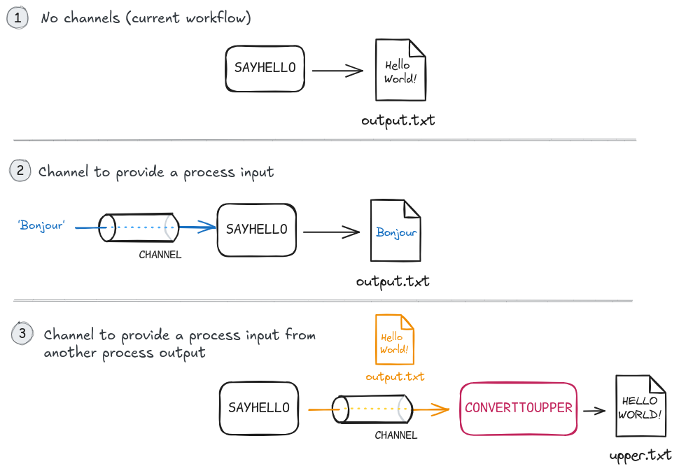
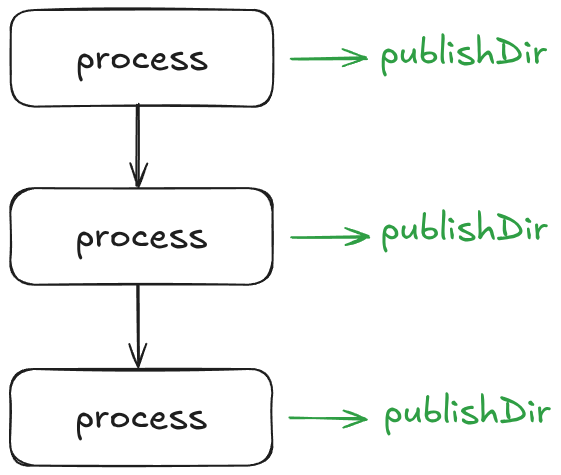

# 1.5 Inputs and Channels

!!! info "Learning objectives"

    1. Describe the differences between Nextflow channel types
    2. Apply input blocks in process definitions
    3. Create channels using channel factories such as `Channel.of()`
    4. Implement process calls that take single and multiple inputs via channels
    5. Evaluate correct vs incorrect input strategies (e.g. _why not to use_ `publishDir` as an input)

So far, you've been emitting a text string ('Hello World!') that has been hardcoded into the script block. In a more realistic situation, you might want to pass a variable input to your script, much like you pass files to command line tools for analysis.

Here you're going to to add some flexibility by introducing **channels** to your workflow and an **input definition** to your `SAYHELLO` process.

## 1.5.1 Passing information through channels

In Nextflow, processes primarily communicate through **channels**. Channels are essentially the 'pipes' of our pipeline, providing a way for data to flow between our processes and defining the overall structure of the workflow.

Channels allow us to handle inputs efficiently by defining which data should
be taken from one step to another. Channels are one of Nextflows key features
that allow us to run jobs in parallel amongst many additional benefits.



This image illustrates a few use cases of channels that we will implement:

- **1** shows our current `hello-world.nf` pipeline where the `SAYHELLO` process always
prints a file called `output.txt` that contains `Hello World!`
- **2** shows how you can provide a text input to a process, via a channel,
to change what is redirected into `output.txt`. In this example, `'Hello World!'`
is replaced with `'Bonjour'`.
- **3** shows how to use the output of a process (`SAYHELLO`) as the input of
another process. The `CONVERTUPPER` process replaces all lower case characters
in `output.txt` to uppercase, and saves it to a different file called `upper.txt`.

There are two kinds of channels: **queue channels** and **value channels**.

### Queue channels

Queue channels are the more common type of channel. It holds a series, or queue,
of values and passes them into a process one at a time. Values you can expect in a queue
channel can be file paths, or values such as strings and numbers. Generally,
a queue channel contains values of the same type.

One important behaviour of queue channels is that the order of the values is
**non-deterministic**. You will not know ahead of time the order of values
within the queue due to it's 'first-in, first-out' (FIFO) nature.

A value in a queue channel can only be used (run) once in a process.

### Value channels

Value channels, as their name suggests, simply store a value. Importantly:

- Value channels can be bound (i.e. assigned) with one and only one value.
- The assigned value can be used multiple times.

When a value channel is passed as an input to a process, its value will be used for every run of that process.

## 1.5.2 Creating channels

Channels are created in one of two ways. The first is as outputs of processes. Each entry in the `output` block of a process creates a separate channel that can be accessed with `<process_name>.out` - or, in the case of named outputs, with `<process_name>.out.output_name`.

The other way to create channels is with special functions called **channel factories**. There are numerous types of channel factories which can be utilised for creating different channel types and data types. The most common channel factories you will use are:

- `Channel.of()`
- `Channel.fromPath()`
- `Channel.fromFilePairs()`.

The latter two are fairly self explanatory, creating channels of file paths and pairs of file paths, respectively. The `Channel.of()` factory is a much more generic method used to create a channel of whatever values are passed to it.

For example, an exercise we will be working through is to create a channel called `greeting_ch` that contains three values - 'Hello World!', 'Bonjour le monde!', 'Holà mundo':

```groovy
greeting_ch = Channel.of('Hello world!', 'Bonjour le monde!', 'Holà mundo')
```

A process consuming this channel would run three times - once for each value.

## 1.5.3 Adding channels to our pipeline

You're going to start by creating a channel with the `Channel.of()` channel factory that will contain your greeting.

!!!note

    You can build different kinds of channels depending on the shape of the input data.

Channels need to be created within the `workflow` definition.

!!!question "Exercise"

    Create a channel named `greeting_ch` with the 'Hello World!' greeting. Create `greeting_ch`
    before the process that runs it.

    ???Solution

        ```groovy title="hello-world.nf" hl_lines="3-4"
        workflow {

            // Create a channel for inputs
            greeting_ch = Channel.of('Hello world!')

            // Emit a greeting
            SAYHELLO()
        }
        ```

## 1.5.4 Adding channels as process inputs

Before `greeting_ch` can be passed to the `SAYHELLO` process as an input, you must first add an **input block** in the process definition.

The inputs in the input block, much like the output block, must have a qualifier and a name:

```groovy
input:
<input qualifier> <input name>
```

Input names can be treated like a variable, and while the name is arbitrary, it should be recognisable.

No quote marks are needed for **variable inputs**. For example:

```
input
val greeting
```

Similar to the output qualifiers discussed in the previous chapter, there are several different input qualifiers, with some of the more common ones being:

- `val`: A value, such as a string or number.
- `path`: A file path.

!!!question "Exercise"

    Add an `input` block to the `SAYHELLO` process with an input value. Update the comment at the same time.

    ???Solution

        ```groovy title="hello-world.nf" hl_lines="1 5-6"
        // Use echo to print a string and redirect to output.txt
        process SAYHELLO {
            publishDir 'results'

            input:
            val greeting

            output:
            path 'output.txt'

            script:
            """
            echo 'Hello World!' > output.txt
            """
        }
        ```

The `SAYHELLO` process is now expecting an input value.

The `greeting_ch` channel can now be supplied to the `SAYHELLO()` process within the workflow block:

```groovy
SAYHELLO(greeting_ch)
```

Without this, Nextflow will throw an error.

!!!question "Exercise"

    Add the `greeting_ch` as an input for the `SAYHELLO` process.

    ???Solution

        ```groovy title="hello-world.nf" hl_lines="7"
        workflow {

            // Create a channel for inputs
            greeting_ch = Channel.of('Hello world!')

            // Emit a greeting
            SAYHELLO(greeting_ch)
        }
        ```

## 1.5.5 Using Nextflow variables within scripts

The final piece is to update the `script` block to use the `input` value.

Each input can be accessed as a variable via the name in its definition. Within the script block, this is done by prepending a `$` character to the input name:

```groovy
script:
"""
echo '$greeting' > output.txt
"""
```

The `'` quotes around `$greeting` are required by the `echo` command to treat the greeting as a single string.

!!!question "Exercises"

    1. Update `hello-world.nf` to use the greeting input.

    ???Solution

        ```groovy title="hello-world.nf" hl_lines="13"
        // Use echo to print 'Hello World!' and redirect to output.txt
        process SAYHELLO {
            publishDir 'results'

            input:
            val greeting

            output:
            path 'output.txt'

            script:
            """
            echo '$greeting' > output.txt
            """
        }

        workflow {

            // Create a channel for inputs
            greeting_ch = Channel.of('Hello world!')

            // Emit a greeting
            SAYHELLO(greeting_ch)
        }
        ```

    2. Save, and run the pipeline (`nextflow run hello-world.nf`). Inspect `results/output.txt`.

    ???Solution

    ```bash
    cat results/output.txt
    ```
    ```console title="Output.txt"
    Hello World! 
    ```

    The process will still function the same and produce the same output, but instead
    takes the values in `greeting_ch` (`'Hello World!'`) as input.
    
!!! note

    Similar to the `output` block in a process, the `input` does not
    **determine** the `input` of process. Recall that it simply *declares* what input should be expected based on the logic in side the `script` block. 

**Yes! Your pipeline now uses an input channel!**

## 1.5.6 Running processes on multiple inputs

Now that we have a channel set up and our process has been reworked to use it, we can very easily start feeding more inputs into the channel and watch `SAYHELLO` run on each one.

The `Channel.of()` factory can take any number of values, separated by commas. Each one will become a separate element in the queue channel. Any process consuming that channel will run once for every element; each run will be separate and in parallel to the rest.

!!!question "Exercise"

    Add additional greetings to `greeting_ch`.

    ???Solution

        ```groovy title="hello-world.nf" hl_lines="4"
        workflow {

            // Create a channel for inputs
            greeting_ch = Channel.of('Hello world!', 'Bonjour le monde!', 'Holà mundo')

            // Emit a greeting
            SAYHELLO(greeting_ch)
        }
        ```

If you now run the workflow again, you should see that `SAYHELLO` runs three times:

```
Launching `main.nf` [curious_hugle] DSL2 - revision: 243f7816c2

executor >  local (3)
[27/ed09aa] SAYHELLO (1) [100%] 3 of 3 ✔
```

Notice that by default Nextflow only prints out one line per process rather than one line *per run* of each process. Sometimes it may be useful to you to have it print out each run on a separate line. To do this, you can add the `-ansi-log false` flag to the command line:

```bash
nextflow run hello-world.nf -ansi-log false
```

The output now looks like:

```
Launching `main.nf` [deadly_wilson] DSL2 - revision: 243f7816c2
[f2/84d334] Submitted process > SAYHELLO (2)
[f4/9f72e1] Submitted process > SAYHELLO (1)
[dc/52fa3d] Submitted process > SAYHELLO (3)
```

There is only one `output.txt` in our `results/` folder. This is because we have hardcoded the output name.
Each time the process is run, it overwrites the existing `output.txt` and the one we see is from the last
process that was run.

!!!note

    If you inspect your `output.txt`, it can contain any one of the greetings specified.
    This is because **the order that tasks are run are non-deterministic**. Nextflow
    tasks run on a FIFO (first-in, first-out) basis, meaning that a task will begin running
    once it is ready. Different factors can impact this, but a common scenario is when 
    the output of a process is ready, the downstream process that uses it as input will
    be exectuted.

## 1.5.7 A note about multiple input channels

The input block can be used to define multiple inputs to the process. Importantly, the number of inputs passed to the process call within the workflow must match the number of inputs defined in the process. For example:

```groovy title="example.nf"
process MYFUNCTION {
    publishDir 'results'

    input:
    val input_1
    val input_2

    output:
    path 'output.txt'

    script:
    """
    echo $input_1 $input_2 > output.txt
    """
}

workflow {
    MYFUNCTION('Hello', 'World!')
}
```

If we view the file:

```bash
cat output.txt
```
```console title="Output"
Hello World!
```

The main caveat when using multiple input channels is that the order of values and files can be unpredictable (non-deterministic). The best practice here is to apply a combination
of [operators](https://www.nextflow.io/docs/latest/reference/operator.html#operators) to combine the multiple channels.
Nextflow's [processes documentation](https://www.nextflow.io/docs/latest/process.html#multiple-input-channels) has an overview of how it works, and recommendations when it should be used in your own pipelines.

## 1.5.8 FAQ: Can I use the `publishDir` as an input to a process?

A common question about Nextflow is whether the `publishDir` can be used as an input to processes. This can sometimes seem like an attractive and useful pattern. For example, you may have several processes generating outputs that need to get collated or summarised in some way at the end of your workflow. If each process puts its final output in the `publishDir` directory, then the final summary process can simply look there for all its inputs.

Unfortunately, this is not good practice, and will very likely either lead to inconsistent results or not work at all. `publishDir` is not really part of the workflow itself; it's more like a "side branch" to the pipeline that acts as a convenient place to put important outputs of the workflow. There are no guarantees about when output files will get copied into `publishDir`, and Nextflow won't know to wait for files to be generated inside before running processes that rely on them.



Ultimately, all processes should be working with channels as their inputs, and `publishDir` should only be used as a final output directory.

!!! abstract "Summary"

    Channels is one of Nextflow's most powerful features by allowing data to flow into, and between processes. In this lesson, we:

    1. Created a queue channel
    2. Used the `val` input qualifer to provide a string input
    3. Modified the `SAYHELLO()` process to use a channel instead of hardcoded strings
    4. Ran a process with multiple values
    5. Learnt the risks of using `publishDir` as a source of input (not recommended)
