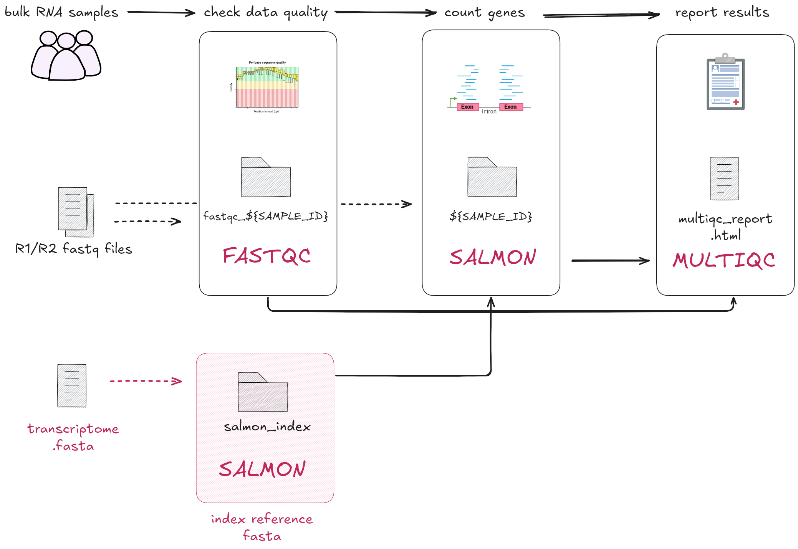

# 2.1 Implementing a simple process with a container  

!!! info "Learning objectives"

    1. Implement a Nextflow process that takes a single file as input.  
    2. Understand the importance of containers in ensuring consistent and
    reproducible execution across processes.
    3. Apply the `publishDir` directive to store process outputs in a specified directory. 

In this lesson we will be implement `00_index.sh` as our first Nextflow process, `INDEX`. Here, we are working with the first step of the RNA-seq data processing workflow: indexing the transcriptome for downstream processes. To do this, we will need to run [Salmon](https://salmon.readthedocs.io/en/latest/salmon.html#salmon)'s indexing mode. 
<br>
<br>
<br>

<br>
<br>
Open the bash script `00_index.sh`:  

```bash title="00_index.sh"
mkdir "results"
salmon index \
    --transcripts data/ggal/transcriptome.fa \
    --index results/salmon_index
```

- The script first creates a `results/` folder then runs the `salmon index` command.  
- The Salmon `--transcripts` flag indicates that the path to the input transcriptome
file is `data/ggal/transcriptome.fa`.  
- The Salmon `--index results/salmon_index` flag tells `salmon` to save the output index files in a directory called `salmon_index`, within the newly created `results` directory.  

!!! tip "Avoid hardcoding arguments by using parameters"

    The paths to the transcriptome file (`data/ggal/transcriptome.fa`) and the output directory (`results/salmon_index`) are hardcoded in this bash script. If you wanted to change the input transcriptome file or the output location, you must manually edit the script. This makes our scripts less flexible and easy to use. 

    As we will see, Nextflow addresses the issue of hardcoded paths by allowing values to be passed dynamically at runtime as [parameters](https://www.nextflow.io/docs/latest/config.html#parameters) (`params`). 

## 2.1.1 Building the `INDEX` process

In the empty `main.nf` script, add the following `process` scaffold with the
script definition:  

```groovy title="main.nf"
process INDEX {
  [ directives ]

  input:
    < process inputs >

  output:
    < process outputs >

  script:
  """
  salmon index --transcripts $transcriptome --index salmon_index
  """
}
```

It contains: 

* The empty `input:` block for us to define the input data for the process. 
* The empty `output:` block for us to define the output data for the process.
* The `script:` block prefilled with the command that will be executed.

!!! info 

    The process [`script`](https://www.nextflow.io/docs/latest/process.html#script)
    block is executed as a Bash script by default. In Part 2 of the workshop, we will
    only be using Nextflow variables within the `script` block.

Note how we have modified the original bash script in two ways.

First, we have replaced the hard-coded path to the transcriptome file with a Nextflow variable: `$transcriptome`. This will allow us to use this process to index any transcriptome FASTA file we want without having to modify the command itself.

Second, we removed the creation of a `results` directory and simply told Salmon to create the new index `salmon_index` within the current directory. The original script created a `results` directory as a way to organise its outputs neatly, but we don't need to worry about being so neat here; instead, as you will see below, we will use the `publishDir` to neatly organise our outputs.

Next, we will edit the `input` and `output` blocks to match the expected
data and results for this process. Looking back at our original bash script `00_index.sh`, we can see that:  

* Our input is a FASTA (`.fa`) file, now represented by the variable `$transcriptome` and provided
to the `--transcripts` flag  
* The name of the index output directory, defined by using the `--index` flag, is called `salmon_index/`  

!!! info "Defining inputs and outputs"

    Remember, input and output definitions require a qualifier and name. For example:  
    ```groovy
    input:
    <input qualifier> <input name>

    output:
    <output qualifier> <output name>
    ```

    The qualifier defines the type of data, and the names are treated like variables.

```groovy title="main.nf" hl_lines="5 8"
process INDEX {
  [ directives ]

  input:
  path transcriptome

  output:
  path 'salmon_index'

  script:
  """
  salmon index --transcripts $transcriptome --index salmon_index
  """
}
```

Note that the input `path transcriptome` refers to a variable, meaning the
actual file or directory provided as input can be changed depending on the data
you provide it. The output `path 'salmon_index'` is fixed, meaning it will
always expect an output folder called `salmon_index`, no matter what the input
is.  

This is how Nextflow can handle different inputs while always producing the
same output name.  

More information on using input and output blocks can be found in the Nextflow documentation for process
[inputs](https://www.nextflow.io/docs/latest/process.html#inputs) and
[outputs](https://www.nextflow.io/docs/latest/process.html#outputs).  

## 2.1.2 Saving our output files to an output directory with `publishDir`  

Next we will implement the Nextflow equivalent of saving the output files into a
`results/` directory. Recall from [Part 1](../part1/04_execution.md#publishing-outputs) 
that we can use the `publishDir` directive to accomplish this. This will direct Nextflow
to copy all of the process' outputs to a given directory.

We can also specify *how* Nextflow will copy our results to the `publishDir` directory by
setting the `mode`. We can tell Nextflow to make a complete copy of the outputs by setting the
`mode` to `"copy"`, e.g.:

```groovy
publishDir "results", mode: 'copy'
```

??? example "Advanced content: `publishDir` modes"

    The `publishDir` directive has several modes that change how it behaves.
    By default, Nextflow will create a **symbolic link** in the publishing directory.
    This is a special type of file that points to another file, similar to a shortcut.
    The advantage of using a symbolic link is that it doesn't require
    duplicating the output files, meaning it uses less space and is quick to make.
    The disadvantage, however, is that the actual data is still stored in the `work/` directory.
    If you ever clean up the `work/` directory, you will break the symbolic links and you will lose
    your data.

    We will be using the `"copy"` mode for the remainder of this workshop, which tells Nextflow
    to make a complete copy of the data within the publishing directory, thereby ensuring that the
    final outputs of the pipeline are always available there.

    The other modes that are available are described in detail in the [Nextflow documentation](https://www.nextflow.io/docs/latest/reference/process.html#publishdir).

Replace the `[ directives ]` placeholder in your `main.nf` script with the `publishDir` 
directive, specifying the directory name as `"results"` and the mode as
`'copy'`. Your `main.nf` should look like this: 

```groovy title="main.nf" hl_lines="2"
process INDEX {
  publishDir "results", mode: 'copy'

  input:
  path transcriptome

  output:
  path 'salmon_index'

  script:
  """
  salmon index --transcripts $transcriptome --index salmon_index
  """
}
```

This process is now directed to copy all output files (i.e. the `salmon_index` directory) into a `results/`
directory. This saves having to specify the output directory in the script
definition each process, or a tedious `mv salmon_index/ results/` step. 

Nextflow also handles whether the directory already exists or if it
should be created. In the `00_index.sh` script you had to manually make a 
results directory with `mkdir -p "results`.

More information and other modes can be found on
[publishDir](https://www.nextflow.io/docs/latest/reference/process.html#publishdir).

## 2.1.3 Adding `params` and the workflow scope  

Now that you have written your first Nextflow process, we need to prepare it
for execution.  

You can think of Nextflow processes as similar to a function definition in R
or Python. We have defined what the process should do, but to actually run it,
we need to call the process within the workflow and pass in the inputs.

To run the process, we need to call it inside the `workflow{}` block, where
we control how data flows through the pipeline. To provide the input data we
need to define parameters. 

In the `00_index.sh` script, the file `data/ggal/transcriptome.fa` was passed
as the input into `salmon index`.  

We will pass in this file path with the `params` scope. Add the following to 
the top of your `main.nf` script:  

```groovy title="main.nf"
// pipeline input parameters
params.transcriptome_file = "$projectDir/data/ggal/transcriptome.fa"
```

!!! info "Implicit variables in Nextflow"
    Nextflow provides a set of implicit variables that can be used in your workflows. These variables are predefined and can be used to access information about the workflow environment, configuration, and tasks. 

    We will use [`$projectDir`](https://www.nextflow.io/docs/latest/config.html#constants) to indicate the directory of the `main.nf` script. This is defined by Nextflow as the directory where the `main.nf` script is located.

!!! info "The `params` and `process` names do not need to match!"  

    In the `INDEX` process, we defined the input as a path called `transcriptome`, whereas
    the parameter is called `transcriptome_file`. These do not need to be identical names
    as they are called in different scopes (the `INDEX` process scope, and `workflow` scope,
    respectively).

Recall that [parameters](https://www.nextflow.io/docs/latest/module.html#module-parameters)
are inputs and options that can be customised when the workflow is 
executed. They allow you to control things like file paths and options for 
tools without changing the process code itself.  

We defined a default value for `params.transcriptome_file` in the `main.nf` script. 
If we need to run our pipeline with a different transcriptome 
file, we can overwrite this default in our execution command with 
`--transcriptome_file` double hyphen flag.

Next, add the workflow scope at the bottom of your `main.nf` after the process:  

```groovy title="main.nf"
// Define the workflow
workflow {

    // Run the index step with the transcriptome parameter
    INDEX(params.transcriptome_file)
}
```

This will tell Nextflow to run the `INDEX` process with
`params.transcriptome_file` as input.

!!! tip "Tip: Your own comments"

    As a developer you can to choose how and where to comment your code!
    Feel free to modify or add to the provided comments to record useful
    information about the code you are writing.

!!! question "Exercise"

    Now that we have a complete process and workflow, we should be able to run it!

    In your VSCode terminal, ensure you are inside the `part2/` directory, then run the following:

    ```bash
    nextflow run main.nf
    ```

    What happened? Did the pipeline run successfully? If not, why not?

    ??? Solution

        Something went wrong! The pipeline didn't successfully run!

        You should have received an error message similar to the following:

        ```console title="Output" hl_lines="27"
         N E X T F L O W   ~  version 24.10.2

        Launching `main.nf` [peaceful_neumann] DSL2 - revision: caa2043bdf

        executor >  local (1)
        executor >  local (1)
        [eb/ec6173] process > INDEX [100%] 1 of 1, failed: 1 ✘
        ERROR ~ Error executing process > 'INDEX'

        Caused by:
        Process `INDEX` terminated with an error exit status (127)


        Command executed:

        salmon index --transcripts transcriptome.fa --index salmon_index

        Command exit status:
        127

        Command output:
        (empty)

        Command error:
        .command.sh: line 2: salmon: command not found

        Work dir:
        /home/training/_part2/work/eb/ec617307600cd47fc5b65d1c60269e

        Tip: you can try to figure out what's wrong by changing to the process work dir and showing the script file named `.command.sh`

        -- Check '.nextflow.log' file for details
        ```

        Nextflow's error message tells us exactly why this failed. The highlighted line above tells us that the `salmon` command couldn't be found.

        Why did this happen? Because we don't have `salmon` installed!

        How do we fix this? We'll explore that in the very next section...

## 2.1.4 Using containers for reproducible pipelines

One of the primary goals of workflow managers like Nextflow is to improve the portability
of a pipeline. Ideally, we could take our pipeline to any computer and it would run with
minimal setup - in short, "write once, run anywere".

However, all but the most trivial workflows will require specialised software that
can't be assumed to be installed on any given computer. To ensure that the pipeline
requires "minimal setup", we can't be asking the end users to install every piece of software
the pipeline requires. So how can we ensure that the end user can run our pipeline
without needing to install all of its dependencies?

The answer is **containers**.

Containers package all the software and dependencies needed
for each tool into a self-contained environment. This means you don’t have to
manually install anything on your system, and your workflow will work
consistently across different systems — whether you're running it on your
local machine, a cluster, or in the cloud. Containers make it easier to share
your workflow with others and ensure it runs the same way every time, no matter
where it's executed.

Nextflow recommends as a **best practice** to use containers to ensure the
reproducibility and portability of your workflows.

Nextflow supports
[multiple container runtimes](https://www.nextflow.io/docs/latest/container.html#).
In this workshop, we'll be demonstrating the value containers can bring to your
workflow by using Singularity.

??? tip "Tip: different tools for different purposes"  

    In this workshop, we're using Singularity to run containers. You may have heard of another container technology before: Docker.
    Both Singularity and Docker work in similar ways to encapuslate tools within an environment to ensure reproducibility.
    However, Docker has certain administrative access requirements that make it unsuitable for some
    systems like HPCs. For this reason, we will be working with Singularity.
    
    You don't have to write your own containers to run in your workflow. There are
    many container repositories out there. We highly recommend using 
    [Biocontainers](https://biocontainers.pro/registry) wherever possible.
    Biocontainers are pre-built and tested containers specifically for
    bioinformatics tools. They have a huge library and great community support. 
    
    You can find Biocontainers at the following repositories:  
    
    * [Biocontiners registry](https://biocontainers.pro/registry)
    * [Quay.io](https://quay.io/organization/biocontainers)
    * [DockerHub](https://hub.docker.com/r/biocontainers/biocontainers)
    * [Seqera containers](https://seqera.io/containers/)

    Another helpful fact is that Docker containers are often able to be converted to Singularity's format, meaning if a tool
    is only available as a Docker image, it is highly likely that it can still be used with Singularity.

In Nextflow, we can specify that a process should be run within a specified container using the [container](https://www.nextflow.io/docs/latest/process.html#container) directive.  

Add the following container directive to the `INDEX` process, above `publishDir`:  

```groovy title="main.nf" hl_lines="2"
process INDEX {
    container "quay.io/biocontainers/salmon:1.10.1--h7e5ed60_0"
    publishDir "results", mode: 'copy'

    input:
    path transcriptome

    output:
    path 'salmon_index'

    script:
    """
    salmon index --transcripts $transcriptome --index salmon_index
    """
}
```

!!! tip
    Usually, containers need to be downloaded using a command such as
    `singularity pull [image]`. All containers have been previously downloaded for the
    workshop beforehand.

??? tip "Tip: use one container per process"
    
    Using single containers for each process in your workflow is considered best practices for the following reasons:

    - **Flexibility**: different processes require different tools (or versions). By using separate containers, you can easily tailor the container to the needs of each process without conflicts.
    - **Build and run efficiency**: Smaller, process-specific containers are faster to load and run compared to one large container that has unnecessary tools or dependencies for every process.
    - **Easier Maintenance**: it’s easier to update or modify one container for a specific process than to manage a large, complex container with many tools.
    - **Reproducibility**: reduces the risk of issues caused by software conflicts.

Now our process has a container associated with it, but before we can run the workflow,
we need to tell Nextflow **how** to run the container. Specifically, we need to specify that
we want to run containers using Singularity. Note that this also requires Singularity
to be installed on your system in order for this to work. Singularity has been 
pre-installed on your Virtual Machine. See the [Nextflow documentation](https://www.nextflow.io/docs/latest/container.html#singularity)
for further details on running workflows with Singularity.

We can configure Nextflow to run containers with Singularity by using the 
`nextflow.config` file.

Create a `nextflow.config` file in the same directory as `main.nf`.  

!!! note

    You can create the file via the VSCode Explorer (left sidebar) or in the
    terminal with a text editor.

    If you are using the Explorer, right click on `part2` in the sidebar and
    select **"New file"**.

Add the following lines to your config file:

```groovy linenums="1" title="nextflow.config"
singularity {
    enabled = true
    cacheDir = "$HOME/singularity_image"
}
```

The syntax `singularity { }` defines the configuration for using Singularity; everything between the curly braces here will tell Nextflow how to use Singularity to run your workflow.

The first line, `enabled = true` simply tells Nextflow to use Singularity. The second line, `cacheDir = $HOME/singularity_image` tells Nextflow to store images in a folder within your home directory called `singularity_image`. This means that Nextflow only has to pull a given image from the internet once; every other time it requires that image, it can quickly load it from this cache directory.

You have now configured Nextflow to run your process within a Singularity container! In this case, the `INDEX` process will use the `quay.io/biocontainers/salmon:1.10.1--h7e5ed60_0` container. As we add more processes, wherever we define the `container` directive, Nextflow will use that container to run that process.

!!! tip

    Remember to save your files after editing them!

We now have a complete process and workflow, along with directives and configuration for using containers. We are ready to try running our workflow again!

## 2.1.5 Running the workflow  

In the terminal, run the command:  

```bash
nextflow run main.nf
``` 

Your output should look something like:  

```console title="Output"
N E X T F L O W   ~  version 24.10.2

Launching `main.nf` [chaotic_jones] DSL2 - revision: 6597720332

executor >  local (1)
[de/fef8c4] INDEX | 1 of 1 ✔
```

Recall that the specifics of the output are randomly generated (i.e.
`[chaotic_jones]` and `[de/fef8c4]` in this example).

In this example, the output files for the `INDEX` process is output in
`work/de/fef8c4...`.

You have successfully run your first workflow!  

## 2.1.6 Inspecting the outputs

You will notice that we have two new folders in our working directory: `results/` and `work/`.

First, let's look at the `results/` directory. It should contain a single subdirectory: `salmon_index/`. Inside are all the files that make up the `salmon` reference index used for quantifying reads.

```bash
ls results
```

```console title="Output"
salmon_index
```

```bash
ls results/salmon_index
```

```console title="Output"
complete_ref_lens.bin   mphf.bin             ref_indexing.log
ctable.bin              pos.bin              reflengths.bin
ctg_offsets.bin         pre_indexing.log     refseq.bin
duplicate_clusters.tsv  rank.bin             seq.bin
info.json               refAccumLengths.bin  versionInfo.json
```

This is the exact same directory structure that our original `00_index.sh` script was creating when running `mkdir "results"` and passing the `--index results/salmon_index` parameter to `salmon`.
But now, Nextflow is handling this for us thanks to the `publishDir` directive we gave to the `INDEX` process.
That directive told Nextflow to create the `results/` directory (if it didn't already exist) and copy the `salmon_index` output into it.

The other directory that has been created is `work/`. This is where Nextflow runs all of our processes and stores all of their associated files.
Understanding how the `work/` directory is organised can be very useful for debugging and diagnosing problems with your processes.

You may recall from [Part 1.3](../part1/03_hellonf.md), every time a process is run, it is given a randomly-generated ID, such as `ec/9ed7c7d13ca353bbd8e99835de8c47`.
This helps Nextflow uniquely identify each instance of every process. You will see a truncated form of this ID printed to the terminal when running Nextflow:

```console title="Nextflow output"
    N E X T F L O W   ~  version 24.10.2

Launching `main.nf` [sleepy_volhard] DSL2 - revision: c2ada21e4e

executor >  local (1)
[ec/9ed7c7] process > INDEX [100%] 1 of 1 ✔
```

Nextflow creates a directory inside `work/` with this same path for each instance of every process. Inside will be the output of that process as well as copies of its inputs:

```bash
ls work/ec/9ed7c7d13ca353bbd8e99835de8c47  # Your work directory will have a different name
```

```console title="Output"
salmon_index  transcriptome.fa
```

There will also be several hidden files that Nextflow uses to run and monitor the process:

```bash
ls -A work/ec/9ed7c7d13ca353bbd8e99835de8c47  # Your work directory will have a different name
```

```console title="Output"
.command.begin  .command.out  .exitcode
.command.err    .command.run  salmon_index
.command.log    .command.sh   transcriptome.fa
```

Of particular interest to us right now is the `.command.sh` file, which contains our process script.

!!! question "Exercises"

    <ol>
        <li>Navigate to the <code>work/</code> directory and open the <code>.command.sh</code> file.</li>
        <li>Compare the <code>.command.sh</code> file with our <code>INDEX</code> process. How do they differ? How are they similar?</li>
    </ol>

    ??? Solution

        The command in `.command.sh` should look very similar to the script block in the `INDEX` process,
        except now the Nextflow variable `$transcriptome` has been replaced by a relative path to the
        `transcriptome.fa` file present in the working directory:
        
        ```groovy title="main.nf"
        process INDEX {
            ...

            script:
            """
            salmon index -t $transcriptome -i salmon_index
            """
        }
        ```

        ```bash title=".command.sh"
        #!/bin/bash -ue
        salmon index -t transcriptome.fa -i salmon_index
        ```

    <ol start="3">
        <li>How does <code>.command.sh</code> compare to the original <code>00_index.sh</code> script?</li>
    </ol>

    ??? Solution
        
        The `.command.sh` script contains a hard-coded path to the copy of the `transcriptome.fa` file within the task directory, which closely resembles our hard-coded `salmon` command in our original `00_index.sh` script:

        ```bash title="00_index.sh"
        salmon index \
            --transcripts data/ggal/transcriptome.fa \
            --index results/salmon_index
        ```

        ```bash title=".command.sh"
        #!/bin/bash -ue
        salmon index -t transcriptome.fa -i salmon_index
        ```

        In a sense, Nextflow is doing the same thing we would have had to do with our original set of bash scripts: make a copy, modify the hard-coded values, and run them.
        Except now, it is all being automated and handled for us by Nextflow!

??? example "Advanced content: the `work/` directory hidden files"

    The other hidden files inside the work directory have the following roles:

    * `.command.run`: A "wrapper script" that contains all the behind-the-scenes logic to run and monitor `.command.sh`.
    * `.command.out`: The standard output log from `.command.sh`.
    * `.command.err`: The standard error log from `.command.sh`.
    * `.command.log`: The output log generated by the `.command.run` wrapper script.
    * `.command.begin`: A file created as soon as the job is launched.
    * `.exitcode`: A file created at the end of the job containing the task exit code (0 if successful)


!!! abstract "Summary"

    In this lesson you have learned:  

    1. How to implement a simple process with one input file  
    2. How to define parameters in your workflow scripts and the command line
    3. How to use configure a process to run using a container   
    4. How to output files in a dedicated `publishDir`  
