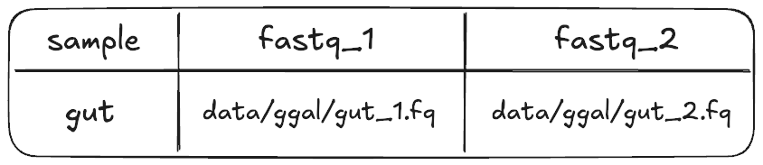

# 2.2 Samplesheets, operators, and groovy  

!!! note "Learning objectives"

    1. Construct a Nextflow process that accepts a tuple input from a channel.
    2. Describe the benefits of using a samplesheet to manage and read in workflow inputs.
    3. Build a custom input channel using Groovy expressions and Nextflow operators. 

In this lesson we will transform the next bash script, `01_fastqc.sh` into a process called `FASTQC`. This step focuses on the next phase of RNAseq data processing: assessing the quality of some our raw sequencing reads. 

To do this, we will need to run [FastQC](https://www.bioinformatics.babraham.ac.uk/projects/fastqc/) 
over pairs of FASTQ files. 


Our goal in porting these bash scripts to Nextflow is to build a workflow that can scale to run on multiple samples with minimal intervention. To do this, we will use a samplesheet, allowing us to provide multiple samples and their corresponding FASTQ files to our Nextflow workflow. 

Building channels in Nextflow can be tricky. Depending on what data you need 
to capture and how you want to organise it you will likely need to use 
[operators](https://www.nextflow.io/docs/latest/operator.html#operators) to
manipulate your channel. We saw some simple operators back in Part 1.
However, sometimes operators alone won't be enough, and you'll
need to also use [Groovy](https://groovy-lang.org/documentation.html)
(Nextflow's underlying programming language) to capture pertinent information.  

Since this is an advanced task, we will provide you with all the code you need. Although Nextflow does not yet offer a built-in operator for reading samplesheets, their use is widespread in bioinformatics workflows. So, we will be building a simple samplesheet reader from a couple of operators and some simple Groovy code.

## 2.2.1 Inspecting our FastQC script

Open the bash script `01_fastqc.sh`:  

```bash title="01_fastqc.sh"
SAMPLE_ID=gut
READS_1="data/ggal/${SAMPLE_ID}_1.fq"
READS_2="data/ggal/${SAMPLE_ID}_2.fq"

mkdir -p "results/fastqc_${SAMPLE_ID}_logs"
fastqc \
    --outdir "results/fastqc_${SAMPLE_ID}_logs" \
    --format fastq ${READS_1} ${READS_2}
```

There's a lot going on in this script, let's break it down.

`SAMPLE_ID=gut` assigns "gut" to the bash variable`SAMPLE_ID`. This is used to:  

- Avoid hardcoding the sample name multiple times in the script  
- Ensure that file pairs of the same sample are processed together (e.g. `gut_1.fq` and `gut_2.fq`)  
- Ensure that this script can be run on different sample pairs  

`READS_1` and `READS_2` specify the paths to the paired gut `.fq` files.  

Similar to the bash script in the previous step (`00_index.sh`), `mkdir -p`
creates an output folder so that the `fastqc` outputs can be saved here.  

In the `fastqc` command,

- `--outdir` specifies the name of the output directory
- `--format` is a required flag to indicate what format the the reads are in
- `${READS_1}` and `${READS_2}` propagate the paths of the `.fq` files  

## 2.2.2 Building the `FASTQC` process  

### Defining the process directives

Start by adding the following `process` scaffold and script definition to your
`main.nf` under the INDEX process code but before the `workflow{}` block:  

```groovy title="main.nf"
process FASTQC {
  container "quay.io/biocontainers/fastqc:0.12.1--hdfd78af_0"
  publishDir "results", mode: 'copy'

  input:
    < process inputs >

  output:
    < process outputs >

  script:
  """
  mkdir -p "fastqc_${sample_id}_logs"
  fastqc --outdir "fastqc_${sample_id}_logs" --format fastq $reads_1 $reads_2
  """
}
```

It contains: 

* Prefilled process directives `container` and `publishDir`.
* The empty `input:` block for us to define the input data for the process. 
* The empty `output:` block for us to define the output data for the process.
* The `script:` block prefilled with the command that will be executed.

Note that for the script block we have removed the initial three lines that contained the bash variable definitions. Instead, we will be using Nextflow variables that are defined within the process' `input` block.

However, note that the `mkdir` and `fastqc` commands that remain look very similar to their original forms, but are now using those Nextflow variables instead of the original bash variables.

!!! info "Dynamic naming"

    Recall that curly brackets are used to pass variables as part of a file name.

??? example "Advanced content: Nextflow vs Bash variables"

    If you are familiar with Bash programming, you may notice that the way we use Nextflow variables looks exactly like how we use Bash variables - by using the `$` symbol followed by the variable name, possibly within curly brackets:

    ```groovy
    script:
    """
    mkdir -p "fastqc_${sample_id}_logs"
    """
    ```

    This actually means that Bash variables can't be used in the same way as they normally are. Instead, if you ever need to use a Bash variable within a Nextflow process, you will first need to **escape** the `$` symbol with a backslash (`\`). This tells Nextflow to ignore the `$` and not interpret it as a Nextflow variable:

    ```groovy
    script:
    """
    SOMEBASHVAR="hello"
    echo \${SOMEBASHVAR}
    """
    ```

    For the purposes of this workshop, we won't be using Bash variables, so you don't need to worry about this quirk for now.
    
### Defining the process `output`

Unlike `salmon` from the previous process, `fastqc` requires that the output
directory be created before running the command, hence the requirement to run
`mkdir -p "fastqc_${sample_id}_logs"` within the `script` block. This is a common 
inconsistency between different bioinformatics tools, so it is good to be aware of it.

Looking at the FastQC command we can see this directory will be our output.  

!!! question "Exercise"

    Replace `< process outputs >` with the appropriate output definition for
    the `FASTQC` process.  

    ??? note "Solution"

        ```groovy title="main.nf" hl_lines="2"
        output:
        path "fastqc_${sample_id}_logs"
        ```

        We've used the `path` qualifier because our output is a directory.
        Output from the bash script is defined by the fastqc `--outdir` flag.
        Because our output contains constant text (i.e. `"fastqc_"` and `"_logs"`),
        we put the whole output string in double quotes and use the dollar sign and curly braces
        to access the `sample_id` variable.

### Defining the process `input`

Now we need to define the `input` block for this process. In this process, 
we're going to use a combination of Nextflow operators and Groovy to do this. 

There are three inputs
for this process definition that can be taken from the script definition you
just added:

1. `$sample_id`
2. `$reads_1`
3. `$reads_2`

In order to ensure we process the sample ID along with its two related FASTQ files together, we will introduce a new input qualifier: the [`tuple`](https://www.nextflow.io/docs/latest/process.html#input-tuples-tuple).

A tuple is simply an ordered collection of objects. When you use a tuple as input to a Nextflow process, it ensures that the objects inside are grouped and processed together as a single unit. This is a requirement when working with multiple pieces of data that are specific to a given sample.

!!! info "Importance of proper data grouping when using Nextflow"

    Nextflow uses channels to run processes in parallel and if you aren't
    careful about how you handle multiple pieces of related data that need to be tied
    together (e.g. sample IDs and FASTQ paths), you may mix datasets up.

    We can use the [input qualifier](https://www.nextflow.io/docs/latest/process.html#inputs)
    `tuple` to group multiple values into a single input definition.

In our case, we have three related pieces of data: a `$sample_id` and its two FASTQ read files `$reads_1` 
and `$reads_2`. We will define a tuple input to ensure that these inputs stay linked and are processed together,
preventing our sample IDs and FASTQ files from getting mixed up between samples.


In the `FASTQC` process, replace `< process inputs >` with the input tuple definition:  

```
tuple val(sample_id), path(reads_1), path(reads_2)
```

Our tuple contains three elements:

* `val(sample_id)` represents the **value** that refers to the sample name.
* `path(reads_1)` represents the **path** to the first read file of paired-end sequencing data.
* `path(reads_2)` represent the **path** to the second read file of paired-end sequencing data.

Note how each item within the tuple has its own qualifier. Also note how we must now wrap each item's name within parentheses, and separte them by commas.

Our `FASTQC` process should now look like this:

```groovy title="main.nf" hl_lines="6"
process FASTQC {
  container "quay.io/biocontainers/fastqc:0.12.1--hdfd78af_0"
  publishDir "results", mode: 'copy'

  input:
  tuple val(sample_id), path(reads_1), path(reads_2)

  output:
  path "fastqc_${sample_id}_logs"

  script:
  """
  fastqc --outdir "fastqc_${sample_id}_logs" --format fastq $reads_1 $reads_2
  """
}
```

## 2.2.3 Reading files with a samplesheet  

Up until this point in the workshop, we have been using a lot of hard-coded values.

In practice, hard-coded values, particularly for file names and sample IDs, should almost never be used. Instead, we need a flexible way of providing variable values to our pipeline. For that purpose, we can use a samplesheet.

A samplesheet is a delimited text file where each row contains information
or metadata that needs to be processed together.


??? Tip "Tip: using samplesheets in scalable bioinformatics workflows"
      
      Working with samplesheets is particularly useful when you have a combination of files and metadata that need to be assigned to a sample in a flexible manner. Typically, samplesheets are written in comma-separated (`.csv`) or tab-separated (`.tsv`) formats. 
      
      We recommend using comma-separated files as they are less error prone and easier to read and write.

Let's inspect `data/samplesheet.csv` with VSCode.

```console title="Output"
sample,fastq_1,fastq_2
gut,data/ggal/gut_1.fq,data/ggal/gut_2.fq
```

Think of this file like a table; each line is a row and within each row are multiple 'columns' delimited by comma symbols (`,`). This samplesheet has two rows. The first is a header row; the values here will be used as names for each of the columns. The second row is a single sample, `gut`. At this stage, we are developing and testing the pipeline, so, we're only working with one sample. The samplesheet has three columns:  

- `sample`: indicates the sample name/prefix (in this case: `gut`)
- `fastq_1`, `fastq_2`: contains the relative paths to the paired read FASTQ files (in this case: `data/ggal/gut_1.fq` and `data/ggal/gut_2.fq`)



The goal in this step is to read the contents of the samplesheet, and transform
it so it fits the input definition of `FASTQC` we just defined:

```bash
tuple val(sample_id), path(reads_1), path(reads_2)
```

Before that, we need to add an input parameter that points to the samplesheet, called `reads`.  

!!! question "Exercise"

    In your `main.nf` add a new input parameter called `reads` and assign it a default path
    to the samplesheet, using the `$projectDir` variable as before.

    ??? note "Solution"

        ```groovy title="main.nf" hl_lines="3"
        // pipeline input parameters
        params.transcriptome_file = "$projectDir/data/ggal/transcriptome.fa"
        params.reads = "$projectDir/data/samplesheet.csv"
        ```

In the next few steps, we will add a mix of [Nextflow operators](https://www.nextflow.io/docs/latest/operator.html) and Groovy
syntax to read in and parse the samplesheet so it is in the correct format
for the process we just added.  

!!! info "Using samplesheets with Nextflow can be tricky business"
    There are currently no Nextflow operators specifically designed to handle samplesheets. As such, we Nextflow workflow developers have to write custom parsing logic to read and split the data. This adds complexity to our workflow development, especially when trying to handle tasks like parallel processing of samples or filtering data by sample type.

Add the following to your workflow scope below where `INDEX` is called:

```groovy title="main.nf" hl_lines="7-12"
// Define the workflow  
workflow {

    // Run the index step with the transcriptome parameter
    INDEX(params.transcriptome_file)

    // Define the fastqc input channel
    Channel.fromPath(params.reads)
        .splitCsv(header: true)
        .map { row -> [row.sample, file(row.fastq_1), file(row.fastq_2)] }
        .view()

}
```

This looks a bit complicated, but the essential idea is that we read in our samplesheet file with the [`.fromPath`](https://www.nextflow.io/docs/latest/reference/channel.html#frompath) channel factory and the [`.splitCSV`](https://www.nextflow.io/docs/latest/reference/operator.html#splitcsv) operator and **transform** the data into our final `tuple` format with the [`.map`](https://www.nextflow.io/docs/latest/reference/operator.html#map) operator. The key takeaway here is to understand that using samplesheets is best practice for reading grouped files and metadata into Nextflow, and that both Nextflow operators and Groovy code need to be chained together to get these in the correct format.

??? example "Advanced content: A deeper look at the samplesheet logic"
    Our samplesheet input channel has used a few common Nextflow operators chained together:

    * [`.fromPath`](https://www.nextflow.io/docs/latest/reference/channel.html#frompath) is a channel factory that creates a channel from one or more files matching a given path or pattern. In this case, this is our samplesheet `.csv` file contained in the `params.reads` parameter, provided with the `--reads` command line flag.
    * [`.splitCsv`](https://www.nextflow.io/docs/latest/reference/operator.html#splitcsv) splits the input file into rows, treating it as a CSV (Comma-Separated Values) file. The `header: true` option means that the first row of the CSV contains column headers, which will be used to access the values by name.
    * `.map { row -> [row.sample, file(row.fastq_1), file(row.fastq_2)] }` uses the [`.map`](https://www.nextflow.io/docs/latest/reference/operator.html#map) operator and some Groovy syntax to transform each row of the CSV file into a tuple, extracting the `sample` value, as well as the `fastq_1` and `fastq_2` file paths from the row.
    * [`.view()`](https://www.nextflow.io/docs/latest/operator.html#view) is a debugging step that outputs the transformed data to the console so we can see how the channel is structured. Its a great tool to use when building your channels.

??? Tip "Tip: using the `view()` operator for testing"
      
      The [`view()`](https://www.nextflow.io/docs/latest/operator.html#view) operator is a useful tool for debugging Nextflow workflows. It allows you to inspect the data structure of a channel at any point in the workflow, helping you to understand how the data is being processed and transformed.

Run the workflow with the `-resume` flag:

```bash
nextflow run main.nf -resume
```

Your output should look something like:  

```console title="Output"
Launching `main.nf` [crazy_einstein] DSL2 - revision: 0ae3776a5e

[de/fef8c4] INDEX [100%] 1 of 1, cached: 1 ✔
[gut, /home/setup2/hello-nextflow/part2/data/ggal/gut_1.fq, /home/setup2/hello-nextflow/part2/data/ggal/gut_2.fq]

```

??? Tip "Tip: using the `-resume` flag"
      
      The `-resume` flag is used to resume a Nextflow workflow from where it left off. If a workflow fails or is interrupted, this flag allows you to skip tasks that were successfully completed, saving time and computational resources. It is also useful when you are developing a workflow and want to test changes without running the entire workflow from the start. 

The chain of commands produces a tuple with three elements that correspond to
the row in the samplesheet. It now fits the requirements of the input
definition of `tuple val(sample_id), path(reads_1), path(reads_2)`: 

```bash
[gut, /home/setup2/hello-nextflow/part2/data/ggal/gut_1.fq, /home/setup2/hello-nextflow/part2/data/ggal/gut_2.fq]
```

!!! quote "How's it going?"

    Once you have run the workflow, select the  **"Yes"** react on Zoom.

Next, we need to assign the channel we create to a variable so it can be passed to the `FASTQC`
process. Assign to a variable called `reads_in`, and remove the `.view()`
operator as we now know what the output looks like.

```groovy title="main.nf" hl_lines="8 11"
// Define the workflow  
workflow {

    // Run the index step with the transcriptome parameter
    INDEX(params.transcriptome_file)

    // Define the fastqc input channel
    reads_in = Channel.fromPath(params.reads)
        .splitCsv(header: true)
        .map { row -> [row.sample, file(row.fastq_1), file(row.fastq_2)] }

}
```

Now that we have an input channel ready that provides the correct format,
we can call the `FASTQC` process.  

!!! question "Exercise"

    In the `workflow` scope after where `reads_in` was defined, call the
    `FASTQC` process with `reads_in` as the input.

    ??? note "Solution"
    
        ```groovy title="main.nf" hl_lines="12-13"
        // Define the workflow  
        workflow {
        
            // Run the index step with the transcriptome parameter
            INDEX(params.transcriptome_file)
        
            // Define the fastqc input channel
            reads_in = Channel.fromPath(params.reads)
                .splitCsv(header: true)
                .map { row -> [row.sample, file(row.fastq_1), file(row.fastq_2)] }

            // Run the fastqc step with the reads_in channel
            FASTQC(reads_in) 
            
        }
        ```

Run the workflow:  

```bash
nextflow run main.nf -resume
```

Your output should look something like:  

```
Launching `main.nf` [tiny_aryabhata] DSL2 - revision: 9a45f4957b

executor >  local (1)
[de/fef8c4] INDEX      [100%] 1 of 1, cached: 1 ✔
[bb/32a3aa] FASTQC (1) [100%] 1 of 1 ✔
```

If you inspect `results/fastqc_gut_logs` there is an `.html` and `.zip` file
for each of the `.fastq` files.  

??? example "Advanced exercise: Inspecting our samplesheet reader"  

    This advanced exercise walks through inspecing the output of the intermediate
    operators in the `reads_in` channel:  

    - `Channel.fromPath`
    - `.splitCsv`

    The current workflow block should look like:
    
    ```groovy title="main.nf"
    // Define the workflow  
    workflow {
    
        // Run the index step with the transcriptome parameter
        INDEX(params.transcriptome_file)
    
        // Define the fastqc input channel
        reads_in = Channel.fromPath(params.reads)
            .splitCsv(header: true)
            .map { row -> [row.sample, file(row.fastq_1), file(row.fastq_2)] }
    
        // Run the fastqc step with the reads_in channel
        FASTQC(reads_in)
    }
    ```

    **`Channel.fromPath`**  

    1. In the workflow scope, comment out the lines for `.splitCsv`, `.map`, and `FASTQC()`
    2. Add `.view()` on the line after `Channel.fromPath` and before the commented `.splitCsv`
    3. Run the workflow with `-resume`  

    ??? note "Solution"

        ```groovy title="main.nf" hl_lines="9-11 14"
        // Define the workflow  
        workflow {
        
            // Run the index step with the transcriptome parameter
            INDEX(params.transcriptome_file)
        
            // Define the fastqc input channel
            reads_in = Channel.fromPath(params.reads)
                .view()
                //.splitCsv(header: true)
                //.map { row -> [row.sample, file(row.fastq_1), file(row.fastq_2)] }
        
            // Run the fastqc step with the reads_in channel
            //FASTQC(reads_in)

        }
        ```
        
        The output of the `Channel.fromPath(params.reads)` step produces a path to the samplesheet:  

        ```console title="Output"
        Launching `main.nf` [hungry_lalande] DSL2 - revision: 587b5b70d1
        
        [de/fef8c4] INDEX [100%] 1 of 1, cached: 1 ✔
        /home/user1/part2/data/samplesheet.csv
        
        ```

    **`.splitCsv`**  

    1. In the workflow scope, *un*comment the line for `.splitCsv`
    2. Move `.view()` to the line after `.splitCsv` (before the commented `.map` line)
    3. Run the workflow with `-resume`  
    
    ??? note "Solution"

        ```groovy title="main.nf" hl_lines="9-10"
        // Define the workflow  
        workflow {
        
            // Run the index step with the transcriptome parameter
            INDEX(params.transcriptome_file)
        
            // Define the fastqc input channel
            reads_in = Channel.fromPath(params.reads)
                .splitCsv(header: true)
                .view()
                //.map { row -> [row.sample, file(row.fastq_1), file(row.fastq_2)] }
        
            // Run the fastqc step with the reads_in channel
            //FASTQC(reads_in)

        }
        ```
   
        `.splitCsv` takes the path from the `.fromPath` operator and reads the file. It outputs a queue channel with one element for each line of the CSV file.
        Each element of this channel is similar to a tuple, except each value is associated with its corresponding column name from the header row of the CSV file:

        ```console title="Output"
        Launching `main.nf` [tiny_yonath] DSL2 - revision: 22c2c9d28f
        [de/fef8c4] INDEX | 1 of 1, cached: 1 ✔
        [sample:gut, fastq_1:data/ggal/gut_1.fq, fastq_2:data/ggal/gut_2.fq]
        ```

        This is called a key-value pair. Each of the values can be accessed by its key value (the column name). Our `.map` operator does exactly this (e.g. `row.sample` and `row.fastq_1`) and formats it into the final tuple that is stored as `reads_in` and passed to `FASTQC`.

    Before proceeding, ensure to *un*comment the `.map` and `FASTQC` lines, and remove `.view()`.


!!! abstract "Summary"

    In this lesson you have learned:

    1. How to implement a process with a tuple input
    2. How to construct an input channel using operators and Groovy
    3. How to use the `.view()` operator to inspect the structure of a channel
    3. How to use the `-resume` flag to skip sucessful tasks
    4. How to use a samplesheet to read in grouped samples and metadata
