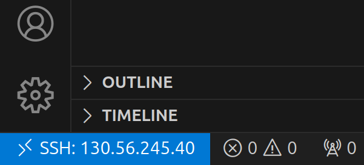
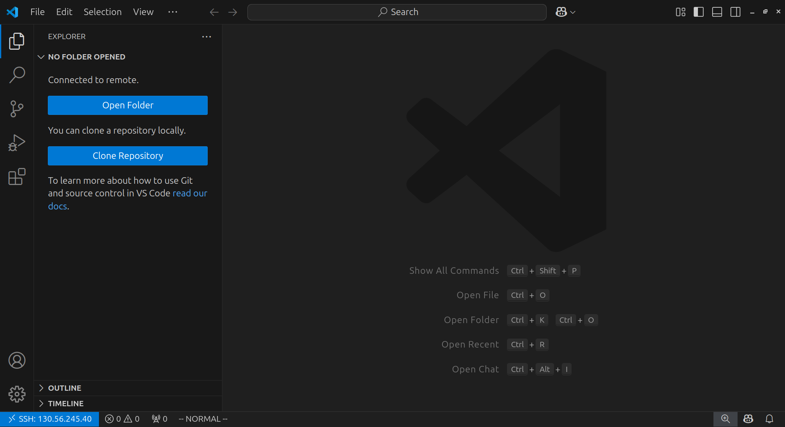
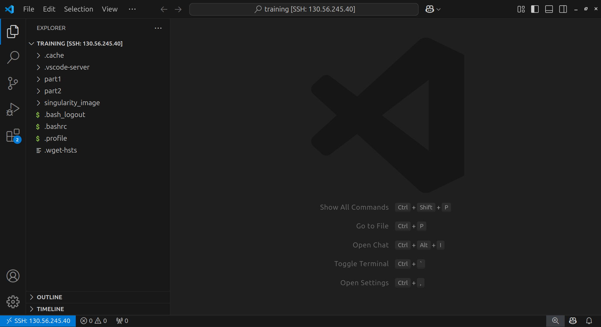
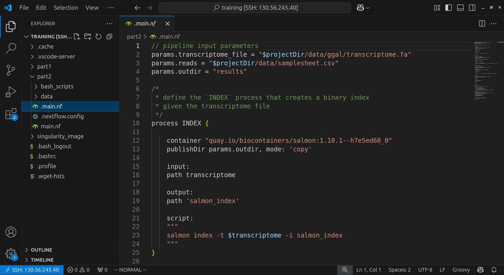

# Setting up your computer

In this workshop, we will be using Virtual Machines (VM) on
[NCI's Nirin Cloud](https://nci.org.au/our-systems/cloud-systems).

The requirements for this workshop are a personal computer with:

- Visual Studio Code (VSCode)
- A web browser

Below, you will find instructions on how to set up VSCode and connect to your VM.
Each participant will be provided with their instances IP address prior to the workshop.
Before the workshop, you must have the following:

1. VSCode installed.
2. The necessary VSCode extensions installed.
3. Be able to connect to your VM.

!!! info

    If you require assistance with the setup, please message the Slack channel!

## Installing Visual Studio Code

Visual Studio Code (VSCode) is a versatile code editor that we will use for the
workshop. We will use VSCode to connect to the VM, navigate the directories,
edit, view and download files.

1. Download VSCode by following the [installation instructions](https://code.visualstudio.com/docs/setup/setup-overview) for your local Operating System.
2. Open VSCode to confirm it was installed correctly.


## Installing the VSCode extensions

Specific VSCode extensions are required to connect to the VM and make working with Nextflow files easier (i.e. syntax highlighting).

1. In the VSCode sidebar on the left, click on the extensions button (four blocks).
2. In the Extensions Marketplace search bar, search for `remote ssh`. Select **"Remote - SSH"**.


3. Click on the blue `Install` button.


4. Search for `nextflow` and install the **"Nextflow"** extension.


5. Close the Extensions tab and sidebar

## Setting up your remote SSH config

1. In VSCode, press `Ctrl+Shift+P` (`Command+Shift+P` on mac) to open the Command Palette.


2. Type `remote ssh` and select **`Remote-SSH: Add New SSH Host...`**. This may appear in a different position in the list.


3. Enter the SSH connection string with the IP address that was provided to you. The connection string should look like: 

```console
ssh training@XXX.XXX.XX.XX
```

Ensure that you replace the **`XXX.XXX.XX.XX`** with your allocated IP address. Press `Enter`.


4. You will be prompted to `Select SSH configuration file to update`. Select your `.ssh/config` file.


5. You should receive a pop-up informing that a host as been added!

## Connecting to the VM

Ensure you have configured your SSH details.

1. In VSCode, press `Ctrl+Shift+P` (`Command+Shift+P` on mac) to open the Command Palette. Alternatively, you may use the search bar at the top of the VSCode window.

2. Type `remote ssh` and select **`Remote-SSH: Connect to Host...`**. This may appear in a different position in the list.


3. Select the IP address that you have configured. A new VSCode window will open.


!!! note "Connecting for the first time"

    When you connect to your VM for the first time, you may need to configure a few settings:

    * If you are prompted with `<ip address> has fingerprint ...`, **Select `Continue`**
    * If you are prompted for a platform, **select `"Linux"`**

<ol start="4">
    <li>Input your allocated password and hit 'Enter'.</li>
</ol>


<ol start="5">
    <li>Once the blue square in the bottom-left of the VSCode window shows <strong><code>SSH: XXX.XXX.XX.XX</strong></code> - you have successfully connected to your instance!</li>
</ol>



## Configuring VSCode for the workshop

1. Select the File Explorer on the left sidebar (icon with two pages) or press
`Ctrl+Shift+E` (Mac: `Cmd+Shift+E`).


2. Select **`Open Folder`**


3. The correct file path should be input by default (`/home/training/`). **Select `OK`**.  
<br>
4. If prompted, select **"Yes, I trust the authors"**.   
<br>
5. The home directory will appear in the left side bar.


6. In the Explorer sidebar, select the `part2` dropdown, then select `.main.nf`. This file will open in a tab. You may need to re-enter you password again.  
<br>
7. Check that syntax highlighting (different parts of the Nextflow code are coloured) is enabled as shown. This is to confirm the VSCode Nextflow extension is working correctly.


!!! warning

    The `.main.nf` file is for testing purposes only. We will not touch this
    file in the workshop.

<ol start="8">
    <li>Toggle the terminal in VSCode by pressing <code>Ctrl+j</code> (<code>Cmd+j</code> on mac).</li>
</ol>


!!! success

    You have now configured VSCode for the workshop!
